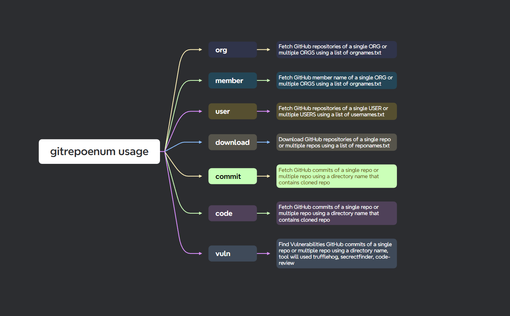

<h1 align="center">
  gitrepoenum
  <br>
</h1>
<h4 align="center">Download all github repositories of a org, user, fetch all member of a org, then Find leaked credentials.</h4>

<p align="center">
  <a href="https://pkg.go.dev/github.com/rix4uni/gitrepoenum"></a>
  <a href="https://github.com/R0X4R/Pinaak/issues"></a>
  <a href="https://goreportcard.com/report/github.com/rix4uni/gitrepoenum"></a>
  <a href="https://github.com/rix4uni/gitrepoenum/blob/master/LICENSE"></a>
  <a href="https://twitter.com/rix4uni"></a>
</p>

<p align="center">
  <a href="#installation">Installation</a> •
  <a href="#usage">Usage</a> •
  <a href="#workflow">Workflow</a>
</p>

## Installation
```
go install github.com/rix4uni/gitrepoenum@latest
```

## Download prebuilt binaries
```
wget https://github.com/rix4uni/gitrepoenum/releases/download/v0.0.1/gitrepoenum-linux-amd64-0.0.1.tgz
tar -xvzf gitrepoenum-linux-amd64-0.0.1.tgz
rm -rf gitrepoenum-linux-amd64-0.0.1.tgz
mv gitrepoenum ~/go/bin/gitrepoenum
```
Or download [binary release](https://github.com/rix4uni/gitrepoenum/releases) for your platform.

## Compile from source
```
git clone --depth 1 github.com/rix4uni/gitrepoenum.git
cd gitrepoenum; go install
```

## Usage
```console
go run main.go -h

           _  __
   ____ _ (_)/ /_ _____ ___   ____   ____   ___   ____   __  __ ____ ___
  / __  // // __// ___// _ \ / __ \ / __ \ / _ \ / __ \ / / / // __  __ \
 / /_/ // // /_ / /   /  __// /_/ // /_/ //  __// / / // /_/ // / / / / /
 \__, //_/ \__//_/    \___// .___/ \____/ \___//_/ /_/ \__,_//_/ /_/ /_/
/____/                    /_/
                                         Current gitrepoenum version v0.0.1

A longer description that spans multiple lines and likely contains
examples and usage of using your application. For example:

Cobra is a CLI library for Go that empowers applications.
This application is a tool to generate the needed files
to quickly create a Cobra application.

Usage:
  gitrepoenum [flags]
  gitrepoenum [command]

Available Commands:
  code        Fetch code from multiple commits
  commit      Show commit logs
  completion  Generate the autocompletion script for the specified shell
  download    Clone Git repositories with a custom directory name and parallel option
  help        Help about any command
  member      Fetch GitHub member name of a single ORG or multiple ORGS using a list of orgnames
  org         Fetch GitHub repositories of a single ORG or multiple ORGS using a list of orgnames
  user        Fetch GitHub repositories of a single USER or multiple USERS using a list of usernames
  vuln        Scan repositories for vulnerabilities using TruffleHog

Flags:
  -h, --help      help for gitrepoenum
  -u, --update    update gitrepoenum to latest version
  -v, --version   Print the version of the tool and exit.

Use "gitrepoenum [command] --help" for more information about a command.
```

## Usage Examples

<details>
  <summary>
    <b>gitrepoenum org -h</b>
  </summary>

```
go run main.go org -h

           _  __
   ____ _ (_)/ /_ _____ ___   ____   ____   ___   ____   __  __ ____ ___
  / __  // // __// ___// _ \ / __ \ / __ \ / _ \ / __ \ / / / // __  __ \
 / /_/ // // /_ / /   /  __// /_/ // /_/ //  __// / / // /_/ // / / / / /
 \__, //_/ \__//_/    \___// .___/ \____/ \___//_/ /_/ \__,_//_/ /_/ /_/
/____/                    /_/
                                         Current gitrepoenum version v0.0.1

Examples:
$ echo "IBM" | gitrepoenum org -c -o output.json
$ cat orgnames.txt | gitrepoenum org -c -o output.json
$ echo "IBM" | gitrepoenum org --delay 1ns
$ echo "IBM" | gitrepoenum org --config custompath/config.yaml -t custompath/github-token.txt

Usage:
  gitrepoenum org [flags]

Flags:
      --config string   path to the config.yaml file (default "$HOME/.config/gitrepoenum/config.yaml")
  -c, --custom-field    Custom Fields JSON output
      --delay string    Delay duration between requests (e.g., 1ns, 1us, 1ms, 1s, 1m) (default "-1ns")
  -h, --help            help for org
  -o, --output string   File to save the output.
  -t, --token string    Path to the file containing GitHub tokens, 1 token per line (default "$HOME/.config/gitrepoenum/github-token.txt")
```
</details>

<details>
  <summary>
    <b>gitrepoenum member -h</b>
  </summary>

```
go run main.go member -h

           _  __
   ____ _ (_)/ /_ _____ ___   ____   ____   ___   ____   __  __ ____ ___
  / __  // // __// ___// _ \ / __ \ / __ \ / _ \ / __ \ / / / // __  __ \
 / /_/ // // /_ / /   /  __// /_/ // /_/ //  __// / / // /_/ // / / / / /
 \__, //_/ \__//_/    \___// .___/ \____/ \___//_/ /_/ \__,_//_/ /_/ /_/
/____/                    /_/
                                         Current gitrepoenum version v0.0.1

Examples:
$ echo "IBM" | gitrepoenum member -c -o output.json
$ cat orgnames.txt | gitrepoenum member -c -o output.json
$ echo "IBM" | gitrepoenum member --delay 1ns
$ echo "IBM" | gitrepoenum member --config custompath/config.yaml -t custompath/github-token.txt

Usage:
  gitrepoenum member [flags]

Flags:
      --config string   path to the config.yaml file (default "$HOME/.config/gitrepoenum/config.yaml")
  -c, --custom-field    Custom Fields JSON output
      --delay string    Delay duration between requests (e.g., 1ns, 1us, 1ms, 1s, 1m) (default "-1ns")
  -h, --help            help for member
  -o, --output string   File to save the output.
  -t, --token string    Path to the file containing GitHub tokens, 1 token per line (default "$HOME/.config/gitrepoenum/github-token.txt")
```
</details>

<details>
  <summary>
    <b>gitrepoenum user -h</b>
  </summary>

```
go run main.go user -h

           _  __
   ____ _ (_)/ /_ _____ ___   ____   ____   ___   ____   __  __ ____ ___
  / __  // // __// ___// _ \ / __ \ / __ \ / _ \ / __ \ / / / // __  __ \
 / /_/ // // /_ / /   /  __// /_/ // /_/ //  __// / / // /_/ // / / / / /
 \__, //_/ \__//_/    \___// .___/ \____/ \___//_/ /_/ \__,_//_/ /_/ /_/
/____/                    /_/
                                         Current gitrepoenum version v0.0.1

Fetch GitHub repositories of a single USER or multiple USERS using a list of usernames

Examples:
$ echo "rix4uni" | gitrepoenum user -c -o output.json
$ cat usernames.txt | gitrepoenum user -c -o output.json
$ echo "rix4uni" | gitrepoenum user --delay 1ns
$ echo "rix4uni" | gitrepoenum user --config custompath/config.yaml -t custompath/github-token.txt

Usage:
  gitrepoenum user [flags]

Flags:
      --config string   path to the config.yaml file (default "$HOME/.config/gitrepoenum/config.yaml")
  -c, --custom-field    Custom Fields JSON output
      --delay string    Delay duration between requests (e.g., 1ns, 1us, 1ms, 1s, 1m) (default "-1ns")
  -h, --help            help for user
  -o, --output string   File to save the output.
  -t, --token string    Path to the file containing GitHub tokens, 1 token per line (default "$HOME/.config/gitrepoenum/github-token.txt")
```
</details>

<details>
  <summary>
    <b>gitrepoenum download -h</b>
  </summary>

```
go run main.go download -h

           _  __
   ____ _ (_)/ /_ _____ ___   ____   ____   ___   ____   __  __ ____ ___
  / __  // // __// ___// _ \ / __ \ / __ \ / _ \ / __ \ / / / // __  __ \
 / /_/ // // /_ / /   /  __// /_/ // /_/ //  __// / / // /_/ // / / / / /
 \__, //_/ \__//_/    \___// .___/ \____/ \___//_/ /_/ \__,_//_/ /_/ /_/
/____/                    /_/
                                         Current gitrepoenum version v0.0.1

Clone Git repositories and customize the directory name to username-repositoryname with an option to clone in parallel.

Examples:
$ echo "https://github.com/rix4uni/gitrepoenum.git" | gitrepoenum download
$ cat reponames.txt | gitrepoenum download
$ cat reponames.txt | gitrepoenum download -o ~/allgithubrepo/download
$ cat reponames.txt | gitrepoenum download -p 100
$ cat reponames.txt | gitrepoenum download -d 1

Usage:
  gitrepoenum download [flags]

Flags:
  -d, --depth int                 Create a shallow clone with a history truncated to the specified number of commits, use -d 0 if you want all commits (default 1)
  -h, --help                      help for download
  -o, --output-directory string   Directory to clone the repositories into (default "/root/allgithubrepo/download")
  -p, --parallel int              Number of repositories to clone in parallel (default 10)
```
</details>

<details>
  <summary>
    <b>gitrepoenum commit -h</b>
  </summary>

```
go run main.go commit -h

           _  __
   ____ _ (_)/ /_ _____ ___   ____   ____   ___   ____   __  __ ____ ___
  / __  // // __// ___// _ \ / __ \ / __ \ / _ \ / __ \ / / / // __  __ \
 / /_/ // // /_ / /   /  __// /_/ // /_/ //  __// / / // /_/ // / / / / /
 \__, //_/ \__//_/    \___// .___/ \____/ \___//_/ /_/ \__,_//_/ /_/ /_/
/____/                    /_/
                                         Current gitrepoenum version v0.0.1

This command retrieves git commit logs based on date and time parameters.

Examples:
$ gitrepoenum commit -i ~/allgithubrepo/download -d 50s -t before -o ~/allgithubrepo/commits
$ gitrepoenum commit -i ~/allgithubrepo/download -d 5h -t before -o ~/allgithubrepo/commits
$ gitrepoenum commit -i ~/allgithubrepo/download -d 1d -t after -o ~/allgithubrepo/commits
$ gitrepoenum commit -i ~/allgithubrepo/download -d all -o ~/allgithubrepo/commits

Date Options:
50s     # 50 seconds
40m     # 40 minutes
5h      # 5 hours
1d      # 1 day
2w      # 2 weeks
3M      # 3 months
1y      # 1 year
all     # All commits

Usage:
  gitrepoenum commit [input] [flags]

Flags:
  -d, --date string     Specify the date range for the commits (e.g., 50s, 40m, 5h, 1d, 2w, 3M, 1y, all) (default "all")
  -h, --help            help for commit
  -i, --input string    Specify the input directory containing Git repositories (default "/root/allgithubrepo/download")
  -o, --output string   Specify the output directory for commit logs (default "/root/allgithubrepo/commits")
  -t, --time string     Specify 'before' or 'after' the given date
```
</details>

<details>
  <summary>
    <b>gitrepoenum code -h</b>
  </summary>

```
go run main.go code -h

           _  __
   ____ _ (_)/ /_ _____ ___   ____   ____   ___   ____   __  __ ____ ___
  / __  // // __// ___// _ \ / __ \ / __ \ / _ \ / __ \ / / / // __  __ \
 / /_/ // // /_ / /   /  __// /_/ // /_/ //  __// / / // /_/ // / / / / /
 \__, //_/ \__//_/    \___// .___/ \____/ \___//_/ /_/ \__,_//_/ /_/ /_/
/____/                    /_/
                                         Current gitrepoenum version v0.0.1

This command fetches code from multiple commits based on a list in commits.txt for each repository.

Examples:
$ gitrepoenum code -i ~/allgithubrepo/download -o ~/allgithubrepo/commits

Usage:
  gitrepoenum code [flags]

Flags:
  -h, --help            help for code
  -i, --input string    Specify the input directory containing Git repositories (default "/root/allgithubrepo/download")
  -o, --output string   Specify the output directory for storing commit code (default "/root/allgithubrepo/commits")
```
</details>

<details>
  <summary>
    <b>gitrepoenum vuln -h</b>
  </summary>

```
go run main.go vuln -h

           _  __
   ____ _ (_)/ /_ _____ ___   ____   ____   ___   ____   __  __ ____ ___
  / __  // // __// ___// _ \ / __ \ / __ \ / _ \ / __ \ / / / // __  __ \
 / /_/ // // /_ / /   /  __// /_/ // /_/ //  __// / / // /_/ // / / / / /
 \__, //_/ \__//_/    \___// .___/ \____/ \___//_/ /_/ \__,_//_/ /_/ /_/
/____/                    /_/
                                         Current gitrepoenum version v0.0.1

This command scans multiple repositories for vulnerabilities using TruffleHog
and saves the results in the specified output directory.

Examples:
$ gitrepoenum vuln
$ gitrepoenum vuln -i ~/allgithubrepo/commits -o ~/allgithubrepo/commits

Usage:
  gitrepoenum vuln [flags]

Flags:
  -h, --help            help for vuln
  -i, --input string    Input directory containing repositories code (default "/root/allgithubrepo/commits")
  -o, --output string   Output directory for vulnerability reports (default "/root/allgithubrepo/commits")
```
</details>

## Demo
[asciinema Link](https://asciinema.org/~rix4uni)

## Workflow
<p align="center"> 
<a href="Workflow/gitrepoenum.png" target="_blank"> 

</a>  
</p>

## TODO


## License
This tool is open source and available under the [MIT License](/LICENSE).
